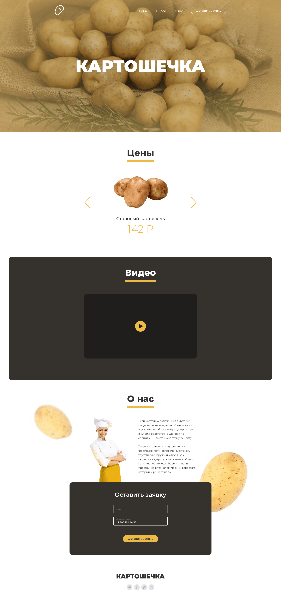

# Potato

A little Vue app

<br/>
<p align="center">Tools used</p>

# [Vue](https://v3.vuejs.org/) ⚡

- 💡 Approachable
- 📦 Versatile
- 🔑 Performant
  <br>

# [Bootstrap](https://getbootstrap.com/) ⚡

- 💡 for styles

<br/>

<br/>
<p align="center">

</p>
<br/>

## Run Locally

Clone the project

```bash
  git clone https://github.com/Paracells/Potato.git
```

Go to the project directory

```bash
  cd Potato
```

Install dependencies

```bash
  npm install
```

Start the server

```bash
  npm run dev
```

# License

[MIT](https://choosealicense.com/licenses/mit/)
